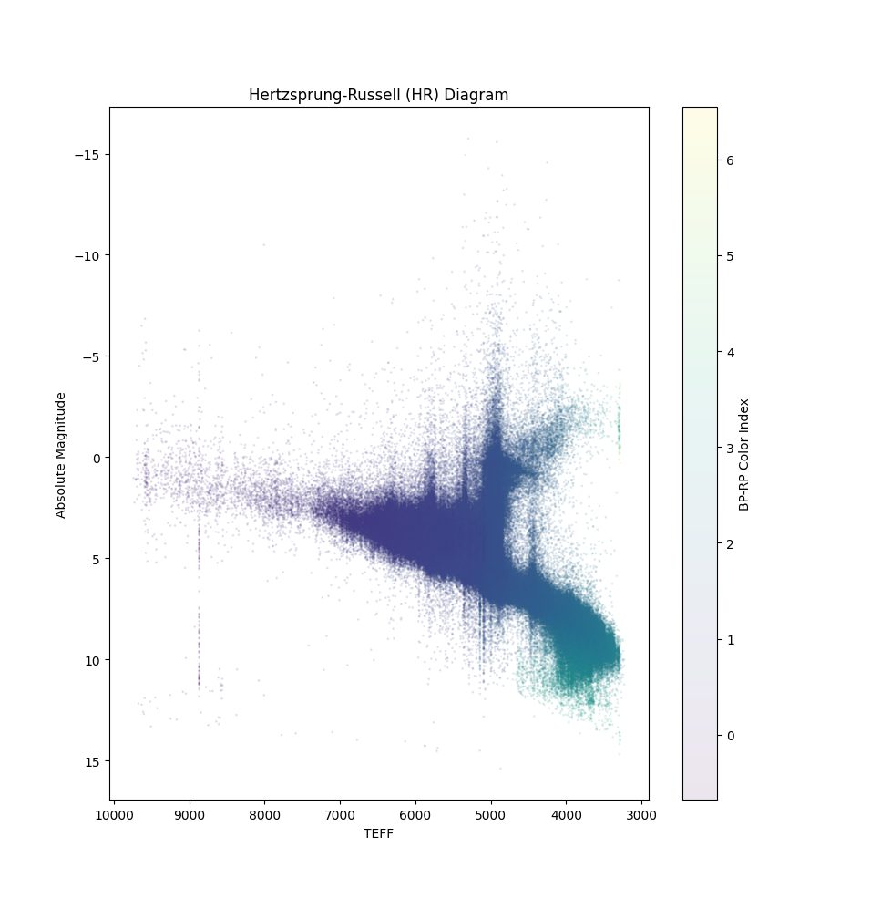

# Hertzsprung-Russell (HR) Diagram

This repository contains tools for downloading data from the [Gaia ESA Archive](https://gea.esac.esa.int/archive/) and generating HR diagrams from that data.

## `hr.py`

This program generates an HR diagram scatterplot. It takes one arg: a directory containing csv files.

## `hr.py` Example Output

## `download_gaia_source.py`

This program downloads `.csv.gz` archives from `gda2/` under the Gaia ESA Archvie to a specified directory.

Args:

- A directory to contain the download files. A directory will be created if the it does not already exist.
- An optional count, specifying the number of `.csv.gz` files to download. Note: each csv contains multiple millions of rows.
